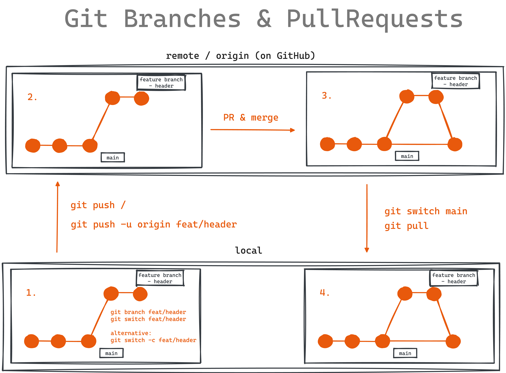

Befehle

Git branch feat/header
Git switch feat/header

Alternative:
Git switch -c feat/header

To push
Git push
/oder/
Git pus -u origin feat/header
(-u =upstream)

---

MAC shortcuts

Option + shit +7 = backslash \ \

Option + n = tilde ~

---

PR (pull request) und dann merge
Wir das ganze
Alternativ Mergerequest
Bei GitHub heißt das Pullrequest

---

Terminal Visual code shortcuts

Command +Y
hochziehen
Und imm Menü

---

Um es wieder local zu aktualisieren
Git switch main
Git pull

---

****\*\*****\*****\*\*****Algemeine_Git-BEFEHLE******\*\*\*\*******\*\*******\*\*\*\*******

---

GIT

git init

Git add (-m)
Git status

Git log —online
(Seeing all the changes)

Get Git Website to GitHub

Git remote
Git remote origin git@github.com:….
Origin
Git push (send stuff to web)

Git push —set-upstream origin main

!!!NEVER CREATE A GIT INSIDE A GIT

You can’t push/commit empty folders
